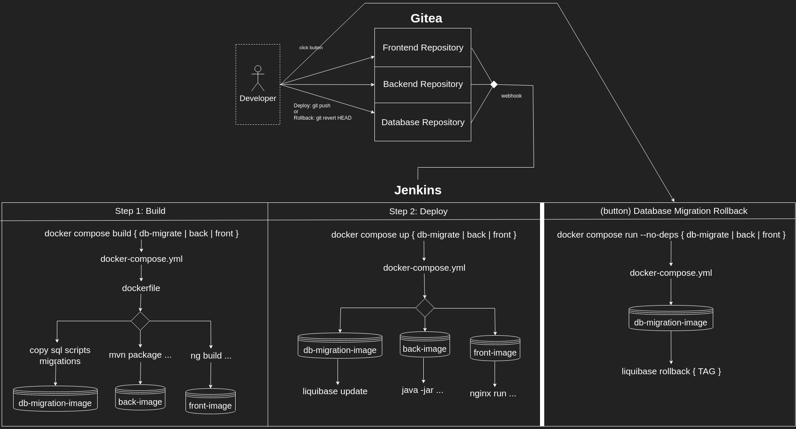
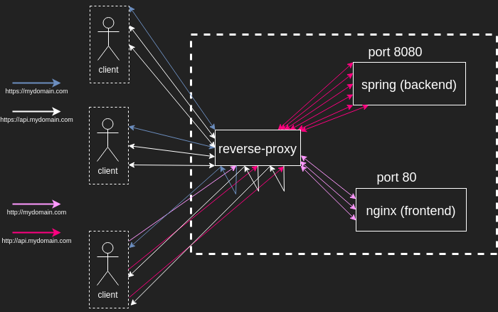

# README

- [README](#readme)
  - [Internal Links](#internal-links)
  - [How it works the DevOps pipeline](#how-it-works-the-devops-pipeline)
  - [How to deploy database](#how-to-deploy-database)
  - [How to deploy the backend](#how-to-deploy-the-backend)
  - [How to deploy the frontend](#how-to-deploy-the-frontend)

## Internal Links

- IMPORTAN: Keep this file in sync with my journal.

- [ToDo](./docs/TODO.md)

<!--
.
.
.
.
.
.
-->

## How it works the DevOps pipeline

The idea is to abstract or reduce the commands to build and deploy,
to only the following two docker commands:

- `docker compose build { db-migration | back | front}`
- `docker compose up -d { db-migration | back | front}`

These two commands are standard on those who knows docker, and from
just watching them, they can get an idea of how works by behind, with
in resume, the `docker-compose.yml` defines how to run the containerized app,
and the `Dockerfile` defines how to build it and deploy it.

So in theory this two commands could build and deploy any kind of
app, whether it uses MAriaDB, Java, GoLand, Angular, React, etc.

Here a graph of the working flow which goes from the `git push` to the
deploy of the app, and in case of rollback it's the same pipeline
just instead of using `git commit` we use `git revert` to apply again the
commit that was working before.



For the connections and https management, I'm using a reverse proxy
to centralize and facilitate the implementation.



<!--
.
.
.
.
.
.
-->

## How to deploy database

This particular layer works differently from the other ones because it's divided into two main components: the schema and the data. That's why I have two different services for the database layer, one to set up the database service and another to migrate the schema, either to deploy or to roll back the changes.

1, We need to have the database service running.

```shell
docker compose up db
```

2, Once we have the DB service running, we can install/update the schema, which
we can apply using the next commands.

- Note1: In this case I do not use the command `build`, because I prefer adding
  the flag `--build`, so this way if I copy and peste the command I can make two
  steps in one, making less likely to forget one.
- Note2: We use `run` instead of `up` as usually because it's one time action, and
  doing it like this makes more sense, for example, we can auto remove it.

```shell
docker compose run --rm --build --name temp db_utils { deploy / rollback / backup / restore }
```

## How to deploy the backend

This layer is easier to deploy because we just have a binary and a configuration
that is modified through environment variables in our .env file and then passed
to the container using the docker-compose.yml file, so we need to make sure we
have the following things.

1, Make sure we have our desired config in the .env file.

```conf
DB_USER=my-db-user
```

2, Make sure we are passing the variable to the container

```yml
back:
  ...
  environment:
    - DB_USER=${DB_USER}
```

3, Make the config is being read by our .properties spring project.

- Note: out of the box, Spring can get an environment variable using the
  following expression: `${VARIABLE_NAME}`

```conf
spring.datasource.url=jdbc:postgresql://${DB_SERVER}:5432/${DB_SCHEMA}
spring.datasource.username=${DB_USER}
```

Once we are sure we have our configuration right, we can start our service with
the following command:

- Note: We just need the build if we have a pending update, and if it's the
  first time running the service, Docker will not find the image and it's going
  to make the build automatically for us.

```shell
docker compose build back

docker compose up back
```

sep

## How to deploy the frontend

It's the same as frontend, we just have the particular case that we inject the backend URL in build time, because this is different between environments, for example, for a stage environment our URL looks like this `api.{local | qa | staging}-example.com` or if its productions looks just like this `api.example.com`, for this I do this.

1, I send the URL through `args` property to the dockerfile.

```yml
front:
  container_name: ${FRONT_NAME}
  build:
    context: ./front
    args:
      BACK_URL: ${BACK_URL}
    dockerfile: front.dockerfile
```

2, In my `front.dockerfile` I remplace the value.

```dockerfile
FROM node:25.7-alpine3.23 AS build
...
ARG BACK_URL
RUN sed -i "s|__BACK_URL__|${BACK_URL}|g" src/environments/environment.ts
...
RUN ng build -c production
```

So that way we have the correct URL automatically for each environment, so as we said we do it the same way as the backend service.

```shell
docker compose build back

docker compose up back
```